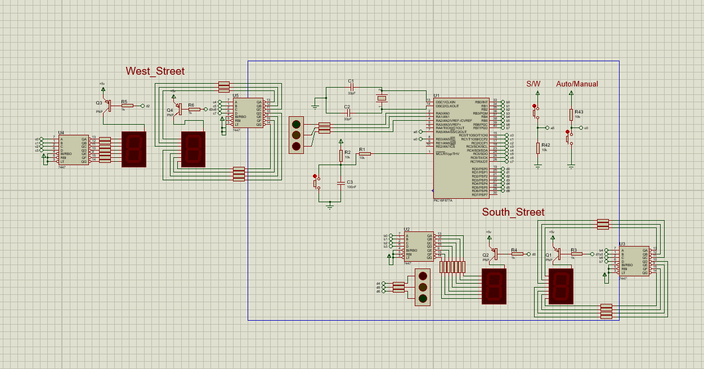
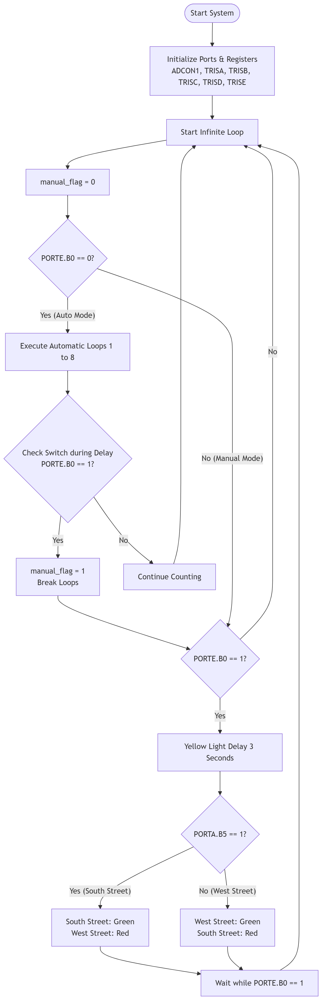

# Traffic Light Controller (PIC16F877A)

A complete traffic light control system designed using the Microchip PIC16F877A microcontroller, featuring seamless transitions between Automatic and Manual modes.

## System Simulation

## Features
- **Automatic Mode:** Sequential timing logic for traffic flow.
- **Manual Mode:** Override control using external switches.
- **Display System:** 7-Segment displays driven by BCD Decoders.

## Software Flowchart

## Tools & Environment
- **Compiler:** mikroC PRO for PIC
- **Simulation:** Proteus VSM
- **Language:** Embedded C
